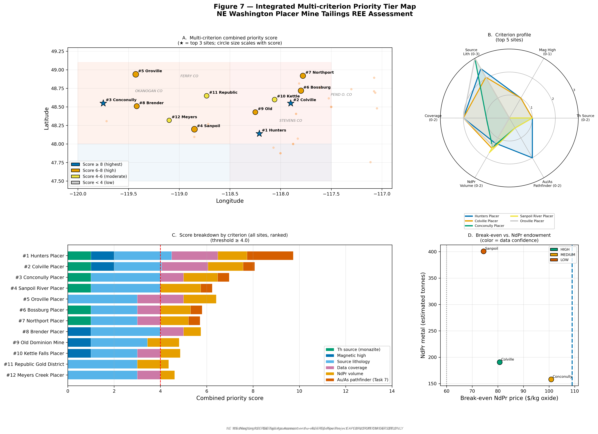
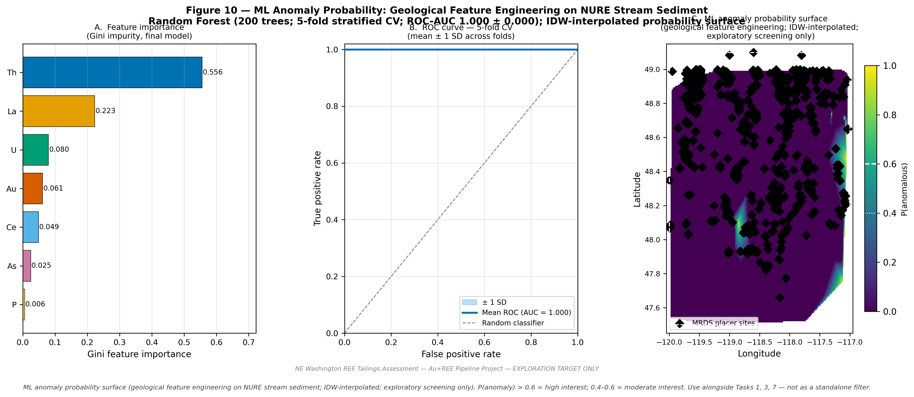
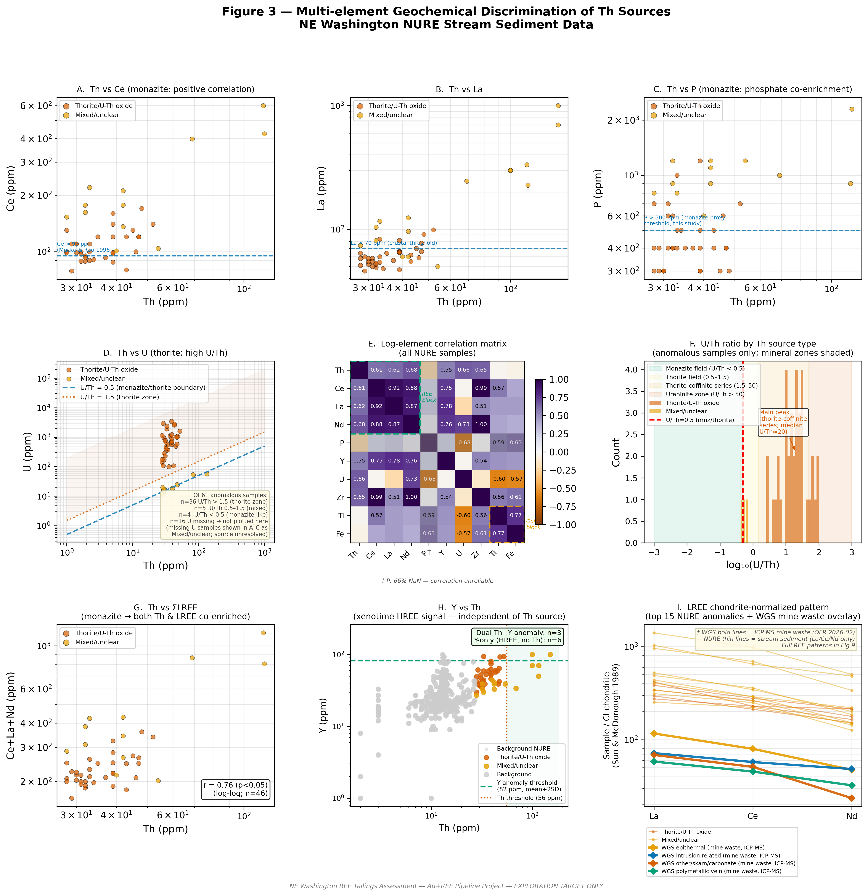
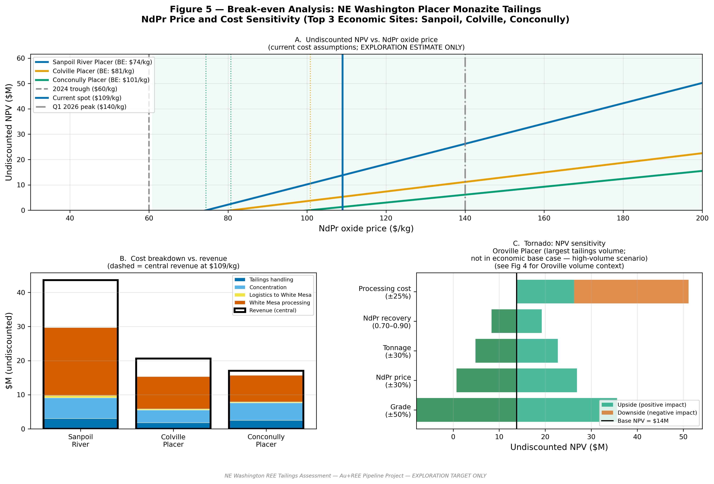

# Au + REE Placer Assessment Pipeline

[](https://github.com/nicole-m-aikin/au-ree-placer-pipeline/actions/workflows/ci.yml)

A reproducible, config-driven geoscience pipeline for screening placer Au and REE/monazite potential from public geochemical, geophysical, and mine-waste datasets — designed to demonstrate end-to-end applied geoscience from dataset QA/QC through ML targeting and economic screening.

## Mineral Systems Framework

This pipeline implements a **mineral systems analysis** of placer Au and REE potential,
following the established **source → pathway → trap → preservation** framework
(Wyborn et al. 1994; McCuaig & Hronsky 2014). Each task maps directly onto a component
of this framework: **source** mineralogy (tasks 1, 3) is characterized via NURE
geochemistry and U/Th discrimination; **pathway** (task 2) is evaluated through
catchment lithology scoring against REE-prospective source domains; **trap** sites
(tasks 4, 5) are assessed for volume, grade, and economic viability; and **preservation**
(tasks 6, 8) addresses tailings disturbance and acid-generating risk. Task 9 integrates
signals across all components into a spatially continuous ML probability surface using
geological feature engineering on the NURE multi-element suite. This vocabulary — source,
pathway, trap, preservation — is the standard language of the exploration industry and
directly informs target prioritization in the integration task (task 10).

---

## Skills Demonstrated

This pipeline was built to show the full applied geoscience stack — from raw public dataset
wrangling through spatial ML and economic screening — in a single reproducible codebase.

- **Mineral systems analysis**: explicit source → pathway → trap → preservation framework (McCuaig & Hronsky 2014); each pipeline task is mapped to a framework component and justified in `METHODOLOGY.md`
- **Geochemical QA/QC of legacy public datasets**: NURE half-MDL substitution, MRDS deduplication, WGS column validation; procedures documented and reproducible
- **Monte Carlo uncertainty quantification**: P10/P50/P90 resource endowment using log-normal grade distributions; results reported with full uncertainty bands, not point estimates
- **ML targeting with geochemically independent ground truth**: MRDS-proximity labels avoid the circular-labeling failure mode common in geochemical classifiers; 5-fold stratified cross-validation; Random Forest with geological feature engineering across the full placer heavy-mineral suite (Th, Ce, La, P, U, Au, As)
- **Spatial geostatistical interpolation**: IDW probability surface for continuous spatial prediction; kriging variance surface identified as production upgrade path
- **Economic screening**: break-even NdPr price analysis, undiscounted NPV rationale, tornado-style weight-sensitivity analysis on integrated priority scores
- **Acid-base accounting (ABA) risk classification**: NP/AP ratio tiers per MEND 2009 thresholds; flags acid-generating sites for environmental due diligence
- **Config-driven, multi-study-area architecture**: NE Washington complete (10 figures, all outputs); Idaho Batholith and Montana Placer stubs ready to activate on data ingestion

## Output Figures

<table>
<tr>
<td><br/><sub>Fig 7 — Multi-criterion integrated priority map (6 weighted criteria, weight-sensitivity tested)</sub></td>
<td><br/><sub>Fig 10 — ML anomaly probability surface (RF + IDW)</sub></td>
</tr>
<tr>
<td><br/><sub>Fig 3 — Multi-element Th source discrimination and chondrite-normalized REE patterns</sub></td>
<td><br/><sub>Fig 5 — Break-even NdPr price, Monte Carlo NPV distribution, and sensitivity tornado</sub></td>
</tr>
</table>

## Key NE WA findings

- **61 Th-anomalous NURE samples** in NE WA; classified MIXED/UNCLEAR or THORITE — no confirmed monazite fingerprint from stream sediment alone
- **WGS ICP-MS** (OFR 2026-02): First Thought Mine has highest TREE concentration (191 ppm); Germania Mine has largest TREE endowment (~21,000 kg)
- **6 of 10 WGS sites** have mean Au ≥ 0.1 ppm (tailings reprocessing threshold)
- **Environmental flag**: Big Iron and Silver Bell are acid-generating (NP/AP < 1)
- **Top result**: Hunters Placer (#1) + Colville Placer (#2) highest combined score; all top-3 sites break even below current NdPr spot (~$109/kg, mid-2026)

## Study areas

| Study area | Config | Status |
|-----------|--------|--------|
| NE Washington (Okanogan/Ferry/Stevens Co.) | `configs/ne_washington/config.yaml` | Complete — 10 figures |
| Idaho Batholith (Orogrande/Dixie/Warren/Florence) | `configs/idaho_batholith/config.yaml` | Stub — needs data |
| Montana Placer (Confederate Gulch/Alder Gulch/Libby Creek) | `configs/montana_placer/config.yaml` | Stub — needs data |

## Quick start (NE Washington)

```bash
python3 -m venv venv && source venv/bin/activate
pip install -r requirements.txt

# Run full pipeline (all 10 tasks)
python pipeline/run_pipeline.py --config configs/ne_washington/config.yaml

# Run specific tasks
python pipeline/run_pipeline.py --config configs/ne_washington/config.yaml --tasks 3 7 9

# List available tasks
python pipeline/run_pipeline.py --config configs/ne_washington/config.yaml --list
```

## Figures produced

| Fig | Task module | Mineral systems component | Description |
|-----|-------------|--------------------------|-------------|
| 1 | `pipeline/task1_coplacer.py` | Source | Aeromagnetic × Th anomaly co-occurrence map |
| 2 | `pipeline/task2_lithology.py` | Pathway | Source lithology map + WGS mine waste sites |
| 3 | `pipeline/task3_geochemistry.py` | Source | Multi-element Th source discrimination |
| 4 | `pipeline/task4_volume.py` | Trap | Lidar volume estimation + Monte Carlo P10/P50/P90 endowment |
| 5 | `pipeline/task5_economics.py` | Trap | Break-even / NPV / sensitivity analysis |
| 6 | `pipeline/task6_framework.py` | All | Decision framework |
| 7 | `pipeline/integration.py` | All | Integrated multi-criterion priority map |
| 8 | `pipeline/task7_pathfinder.py` | Trap | Au/As pathfinder anomaly map |
| 9 | `pipeline/task8_mine_waste.py` | Preservation | WGS mine waste REE + critical minerals |
| 10 | `pipeline/task9_ml_targeting.py` | All | ML anomaly probability surface (geological feature engineering) |

All outputs land in `{outputs_dir}` defined in the config (default: `ne_wa_ree/outputs/` for NE WA).

## ML Targeting Model (Task 9)

`pipeline/task9_ml_targeting.py` trains a Random Forest binary classifier on NURE stream
sediment geochemistry to produce `fig10_ml_anomaly_probability.png` — three panels:

- **Panel A** — Gini feature importance (log₁₀-transformed Th, Ce, La, P, U, Au, As, Ti, Fe, Zr, Y)
- **Panel B** — ROC curve from 5-fold stratified CV (mean ± 1 SD band)
- **Panel C** — Continuous IDW-interpolated probability surface over the study area

**Geological feature engineering:** Log₁₀ transformation of the multi-element suite
converts log-normal geochemical distributions to approximately normal and combines
multiple pathfinder elements into a single probabilistic model — operationalizing the
multi-element approach from tasks 1, 3, 7 as a spatially explicit probability surface.

**Interpretation guidance:**
- P(anomaly) > 0.6: high interest — prioritize for field follow-up
- P(anomaly) 0.4–0.6: moderate interest — assess alongside Tasks 1, 3, 7
- Use as a screening tool alongside, not instead of, the task 1/3/7 hard criteria

## Scientific Methodology

See [`METHODOLOGY.md`](METHODOLOGY.md) for full scientific justification of every
non-obvious methodological choice, including:

- Mineral systems framework (source/pathway/trap/preservation) — how each task maps onto it
- Dataset QA/QC procedures (NURE half-MDL, WGS column validation, MRDS dedup)
- Geochemical anomaly threshold rationale (log-normal; Ahrens 1954; Reimann & Filzmoser 2000)
- Th source mineral discrimination (U/Th ratios; Mücke & Bhaskara Rao 1996)
- Chondrite normalization (CI chondrite; Sun & McDonough 1989)
- Monte Carlo volume/grade uncertainty model (P10/P50/P90; log-normal grade)
- ABA risk tiers (MEND 2009 NP/AP thresholds)
- NPV undiscounted rationale
- Combined priority scoring weights
- ML model and IDW interpolation approach and limitations
- 3D modeling scope and what is explicitly out of scope

## Directory structure

```
configs/
  ne_washington/config.yaml   # NE WA study area (comprehensive)
  idaho_batholith/config.yaml # Idaho Batholith stub
  montana_placer/config.yaml  # Montana Placer stub
pipeline/
  utils.py                    # Shared utilities (WONG palette, load_nure, etc.)
  task1_coplacer.py
  task2_lithology.py
  task3_geochemistry.py
  task4_volume.py             # Monte Carlo P10/P50/P90 endowment
  task5_economics.py
  task6_framework.py
  task7_pathfinder.py
  task8_mine_waste.py
  task9_ml_targeting.py       # Random Forest + IDW probability surface
  integration.py              # Weight sensitivity + priority ranking
  run_pipeline.py             # CLI entry point (10 tasks)
tests/
  test_utils.py               # pytest unit tests for core utils
ne_wa_ree/
  data/                       # NE WA input data (MRDS, aeromagnetic, NURE, lidar)
  outputs/                    # Figures, tables, GeoJSONs
data/
  nure/                       # NURE stream sediment CSVs
```

## Config schema

Each `config.yaml` defines the study area and overrides all hardcoded values:

```yaml
study_area:
  name: "NE Washington"
  bbox: {lon_min, lon_max, lat_min, lat_max}

outputs_dir: "ne_wa_ree/outputs"   # backward-compat for NE WA

data:
  nure_csv: "data/nure/nure_ne_wa_sediment.csv"
  wgs_excel: null    # or path; also resolved via WGS_OFR2026_PATH env var

sites:               # list of mine sites with coordinates, lidar, topo, volume
geology_domains:     # list of polygon domains with lithology scores
rivers:              # polylines for map panels
economics:           # ndpr_price_central, tailings_handling_cost, ...
scoring:             # weights and tier thresholds for integration
```

## Data requirements

Large raster files (lidar, DEM, aeromagnetics) are **not included** due to size. See [`ne_wa_ree/DATA_SOURCES.md`](ne_wa_ree/DATA_SOURCES.md) for download instructions.

Key public sources:
- **NURE stream sediment**: [USGS NGDB](https://mrdata.usgs.gov/ngdb/sediment/) — included in `data/nure/`
- **MRDS mine sites**: [USGS MRDS](https://mrdata.usgs.gov/mrds/) — included in `ne_wa_ree/data/mrds/`
- **WGS OFR 2026-02** (mine waste): set `WGS_OFR2026_PATH` env var or `data.wgs_excel` in config

### Preparing NURE data for a new study area

```bash
# Set paths to your NGDB CSV export
export NGDB_EXTRACT_DIR=/path/to/ngdbsed-csv/ngdbsed
export NGDB_SHARED_REPO=/path/to/ngdb-processed

# Override bounding box for a different state
export NURE_LAT_MIN=44.0 NURE_LAT_MAX=46.0
export NURE_LON_MIN=-116.0 NURE_LON_MAX=-114.0

python prep_nure.py
```

## Running a single task standalone

Each task module can be run directly:

```bash
python pipeline/task3_geochemistry.py configs/ne_washington/config.yaml
python pipeline/task9_ml_targeting.py configs/ne_washington/config.yaml
```

## Running tests

```bash
pytest tests/ -v
```

## Disclaimers

All outputs are **exploration screening estimates only** and do not constitute a mineral resource estimate under NI 43-101 or any other reporting standard. Economic figures are illustrative and subject to substantial uncertainty. Ground truthing required before any investment decision.

## References

- Sun & McDonough 1989 — CI chondrite normalisation values
- Mücke & Bhaskara Rao 1996 — monazite discrimination criteria
- Cheney et al. 1994 — Th content of metamorphic monazite
- van Alderwerelt & Di Fiori 2026 — WGS OFR 2026-02 mine waste characterization
- McCuaig & Hronsky 2014 — mineral systems framework
- Wyborn et al. 1994 — source-pathway-trap-preservation model
- USGS NURE HSDB — National Uranium Resource Evaluation geochemical database
- Rudnick & Gao 2003 — upper continental crust composition
