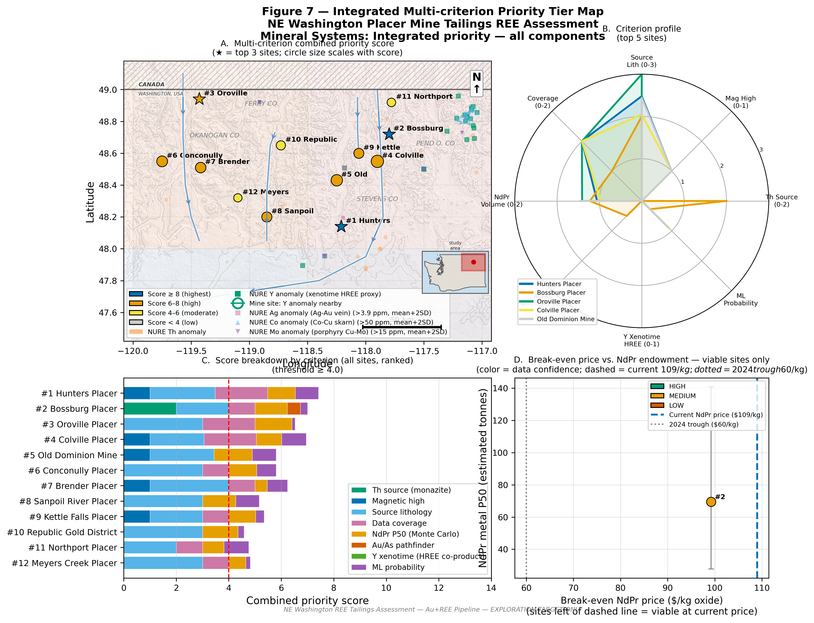
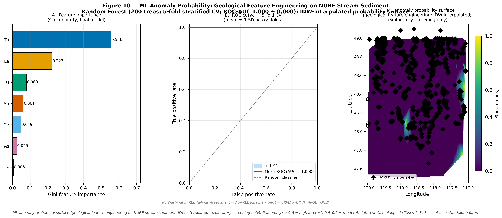
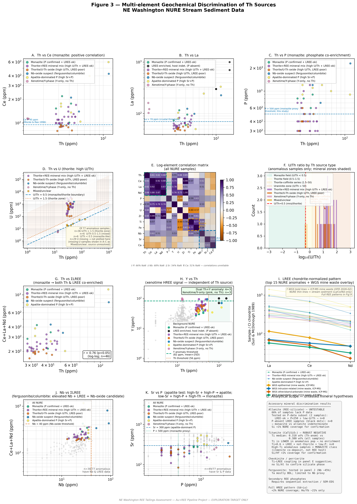
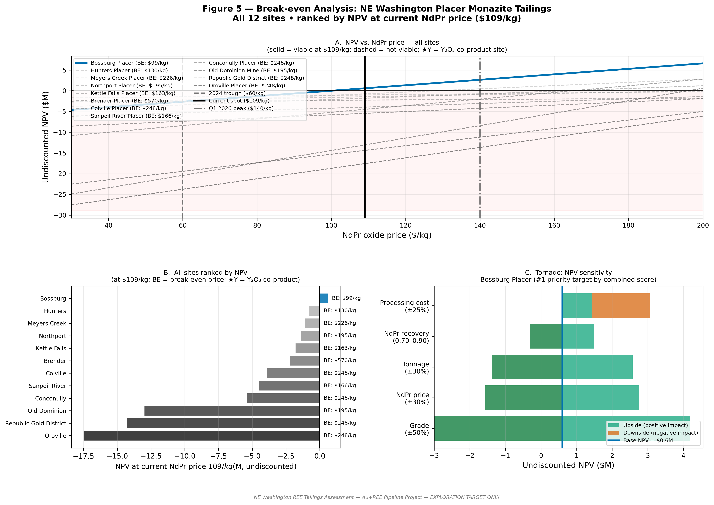

# Au + REE Placer Assessment Pipeline

[](https://github.com/nicole-m-aikin/au-ree-placer-pipeline/actions/workflows/ci.yml)

**Live doorbell:** [https://placer-lookalike.onrender.com/docs](https://placer-lookalike.onrender.com/docs) — Washington gold-placer lookalike API, not a national model. Idaho transfer AUC 0.50; California Sierra 0.52.

A reproducible, config-driven geoscience pipeline for screening placer Au and REE/monazite potential from public geochemical, geophysical, and mine-waste datasets — designed to demonstrate end-to-end applied geoscience from dataset QA/QC through ML targeting and economic screening.

## Mineral Systems Framework

This pipeline implements a **mineral systems analysis** of placer Au and REE potential,
following the established **source → pathway → trap → preservation** framework
(Wyborn et al. 1994; McCuaig & Hronsky 2014). Each task maps directly onto a component
of this framework: **source** mineralogy (tasks 1, 3) is characterized via NURE
geochemistry and U/Th discrimination; **pathway** (task 2) is evaluated through
catchment lithology scoring against REE-prospective source domains; **trap** sites
(tasks 4, 5) are assessed for volume, grade, and economic viability; and **preservation**
(tasks 6, 8) addresses tailings disturbance and acid-generating risk. Task 9 integrates
signals across all components into a spatially continuous ML probability surface using
geological feature engineering on the NURE multi-element suite. This vocabulary — source,
pathway, trap, preservation — is the standard language of the exploration industry and
directly informs target prioritization in the integration task (task 10).

---

## Skills Demonstrated

This pipeline was built to show the full applied geoscience stack — from raw public dataset
wrangling through spatial ML and economic screening — in a single reproducible codebase.

- **Mineral systems analysis**: explicit source → pathway → trap → preservation framework (McCuaig & Hronsky 2014); each pipeline task is mapped to a framework component and justified in `METHODOLOGY.md`
- **Geochemical QA/QC of legacy public datasets**: NURE half-MDL substitution, MRDS deduplication, WGS column validation; procedures documented and reproducible
- **Monte Carlo uncertainty quantification**: P10/P50/P90 resource endowment using log-normal grade distributions; results reported with full uncertainty bands, not point estimates
- **ML targeting with geochemically independent ground truth**: MRDS-proximity labels avoid the circular-labeling failure mode common in geochemical classifiers; Random Forest on the placer heavy-mineral suite (Th, Ce, La, P, U, Au, As, Ti, Fe, Zr, Y); shuffled 5-fold CV ROC-AUC 0.891 ± 0.018; dead-zone spatial CV 0.699 ± 0.055
- **Transfer test, not a national model**: the frozen NE WA forest scored on Idaho Batholith NURE at AUC **0.50** and on California Sierra foothills NURE at **0.52**. Those numbers are on `/model-info`. Do not retrain to hide them.
- **Public lookalike API**: FastAPI `/predict` at [placer-lookalike.onrender.com](https://placer-lookalike.onrender.com/docs) — chemistry in, P(lookalike) + tree-vote spread + distance to a training gold mine out. Not Task 4 tonnes.
- **Catchment walk list**: Task 11 GeoPackage with NURE grabs vs pan pins (slope break / power drop / junction). Chemistry picks the creek; geometry picks the hole.
- **Spatial geostatistical interpolation**: IDW probability surface for continuous spatial prediction; kriging variance surface identified as production upgrade path
- **Economic screening**: break-even NdPr price analysis, undiscounted NPV rationale, tornado-style weight-sensitivity analysis on integrated priority scores
- **Acid-base accounting (ABA) risk classification**: median NP/AP ratio tiers per MEND 2009 thresholds; flags acid-generating sites for environmental due diligence
- **Config-driven, multi-study-area architecture**: NE Washington complete (Figs 1–11); Idaho and California Sierra are transfer tests; Montana stays a stub

## Output Figures

<table>
<tr>
<td><br/><sub>Fig 7 — Multi-criterion integrated priority map (8 weighted criteria, weight-sensitivity tested)</sub></td>
<td><br/><sub>Fig 10 — ML anomaly probability surface (RF + IDW)</sub></td>
</tr>
<tr>
<td><br/><sub>Fig 3 — Multi-element Th source discrimination and chondrite-normalized REE patterns</sub></td>
<td><br/><sub>Fig 5 — Break-even NdPr price, Monte Carlo NPV distribution, and sensitivity tornado</sub></td>
</tr>
</table>

## Key NE WA findings

- **77 Th-anomalous NURE samples** (7.4% of 1,045) resolved into 8 mineral-host classes: 35 thorite or thorite–REE mix, 16 xenotime/Y-phase, 6 apatite-dominated, 4 confirmed monazite (P-confirmed + LREE), 4 LREE-enriched with indeterminate host, 3 Nb-oxide suspect, 9 unresolved
- **WGS ICP-MS** (OFR 2026-02): First Thought Mine has highest TREE concentration (191 ppm); Germania Mine has largest TREE endowment (~21,000 kg)
- **6 of 10 WGS sites** have mean Au ≥ 0.1 ppm (tailings reprocessing threshold)
- **Environmental flag**: Big Iron, Silver Bell, and Turk Mine are acid-generating (median NP/AP < 1)
- **Top result**: After tightening the site–NURE join to 0.10° (nearest sample, not max-Th in 0.25°), Hunters remains #1 (score 8.5) on magnetics, lithology, data confidence, and ML — not monazite. Local grab is C164654 (20 ppm BACKGROUND, 5.8 km). Bossburg is #2 and the only local Th anomaly (33 ppm MONAZITE, C178928) plus the only site below the $109/kg NdPr benchmark. Oroville is #3 on volume at background grade. Combined NdPr P50 is 712 t.
- **Airborne check (Fig 1b)**: Creek Th and NURE aerial eTh barely agree (Spearman ρ ≈ 0.05). Of 77 stream Th highs, only C165101 (26 km SSE of Hunters) is `both_high`. Do not read a stream-sediment Th anomaly as Th-rich bedrock under a ranked pile.

## Study areas

| Study area | Config | Status |
|-----------|--------|--------|
| NE Washington (Okanogan/Ferry/Stevens Co.) | `configs/ne_washington/config.yaml` | Complete — Figs 1–11 + walk-list GeoPackage |
| Idaho Batholith (Orogrande/Dixie/Warren/Florence) | `configs/idaho_batholith/config.yaml` | Transfer AUC **0.50** + walk-list GeoPackage (WA lookalike P, local gold pins) |
| California Sierra placer foothills (Feather/Yuba/American) | `configs/california_sierra/config.yaml` | Transfer AUC **0.52** + walk-list GeoPackage (WA lookalike P; Au/As missing) |
| Montana Placer (Confederate Gulch/Alder Gulch/Libby Creek) | `configs/montana_placer/config.yaml` | Stub — not a fourth belt until someone asks |

## Public doorbell (chemistry → P(gold-placer lookalike))

**Live:** [https://placer-lookalike.onrender.com/docs](https://placer-lookalike.onrender.com/docs)

A FastAPI service loads the **frozen** Task 9 forest. It is a doorbell, not a
discovery engine: send NURE-style ppm (and `fe_unit`), get `probability`,
`tree_vote_spread`, and — if you send lon/lat — distance to the nearest
**training** gold mine. It does not emit Task 4 tonnes. It is not a national
model. `/model-info` reports shuffled CV 0.891, spatial CV 0.70, Idaho transfer 0.50, and California transfer 0.52.

```bash
# local
pip install -r requirements-api.txt
uvicorn api.app:app --host 0.0.0.0 --port 8000

curl -s localhost:8000/health
curl -s localhost:8000/model-info | python -m json.tool
curl -s localhost:8000/predict -H 'Content-Type: application/json' -d '{
  "Th": 12, "Ce": 66, "La": 38, "P": 700, "U": 3.2,
  "Au": 0.004, "As": 1.5, "Ti": 520, "Fe": 2.7, "Zr": 96, "Y": 18,
  "fe_unit": "wt_pct",
  "lon": -118.21, "lat": 48.14
}'
```

Docker (same contract; Render free tier uses `render.yaml`):

```bash
docker build -t placer-lookalike .
docker run --rm -p 8000:8000 placer-lookalike
```

The model files are in `models/`. One click starts the free web service from this repo:

[](https://render.com/deploy?repo=https://github.com/nicole-m-aikin/au-ree-placer-pipeline)

Already deployed: **https://placer-lookalike.onrender.com/docs**. First hit on the free tier is slow (cold start). This is a Washington lookalike screen, not a national model.

## Second belt (frozen forest — Idaho, then California)

```bash
python -m pipeline.task12_second_belt configs/idaho_batholith/config.yaml
python -m pipeline.task12_second_belt configs/california_sierra/config.yaml
```

Downloads that box's NURE (USGS HSSR CSV) and gold MRDS, scores them with the
NE Washington joblib, upserts `models/task9_rf_placer_gold.transfers.json`.
Idaho stays the legacy `transfer.json` sidecar.

| Belt | Grabs | Near gold (0.15°) | AUC 0.15° | AUC 0.05° | Mean P near / far |
|------|------:|------------------:|----------:|----------:|------------------:|
| Idaho Batholith | 2,465 | 79% | **0.50** | 0.48 | 0.38 / 0.38 |
| CA Sierra foothills | 596 | 88% | **0.52** | 0.61 | 0.38 / 0.38 |

Sierra HSSR in this box has no Au or As — those two features are filled with
the Washington training medians. Tightening the gold circle to 0.05° lifts
California to 0.61 and does nothing for Idaho. Mean P is still flat.
**Does not retrain.** Do not turn this into a continental forest.

Walk-list GeoPackages use that same frozen P plus each belt's own gold pins,
30 m DEM, and SGMC geology. Open the copies with no `+` in the path:

```bash
# rebuild (needs a local 30 m DEM from pipeline.fetch_dem)
python -m pipeline.fetch_dem --config configs/idaho_batholith/config.yaml
python -m pipeline.task11_field_campaign configs/idaho_batholith/config.yaml
python -m pipeline.task11_field_campaign configs/california_sierra/config.yaml
```

- Idaho: `~/projects/task11_id_batholith_field_campaign.gpkg` — 2 expedition, 4 confirm, 16 pans
- California: `~/projects/task11_ca_sierra_placer_field_campaign.gpkg` — **0 expedition, 0 confirm**, 8 watch, 10 pans

California never crosses P=0.6. The walk list is geometry. The doorbell still does not know the Sierra.

## Quick start (NE Washington)

```bash
python3 -m venv venv && source venv/bin/activate
pip install -r requirements.txt

# Run full pipeline (tasks 1–11 on this config; 12 needs a second-belt config)
python pipeline/run_pipeline.py --config configs/ne_washington/config.yaml

# Run specific tasks
python pipeline/run_pipeline.py --config configs/ne_washington/config.yaml --tasks 3 7 9

# List available tasks
python pipeline/run_pipeline.py --config configs/ne_washington/config.yaml --list
```

## Figures produced

| Fig | Task module | Mineral systems component | Description |
|-----|-------------|--------------------------|-------------|
| 1 | `pipeline/task1_coplacer.py` | Source | Aeromagnetic × Th anomaly co-occurrence map; Fig 1b airborne eTh vs stream-sediment Th when radiometric TIFFs are present |
| 2 | `pipeline/task2_lithology.py` | Pathway | Source lithology map + WGS mine waste sites |
| 3 | `pipeline/task3_geochemistry.py` | Source | Multi-element Th source discrimination |
| 4 | `pipeline/task4_volume.py` | Trap | Lidar volume estimation + Monte Carlo P10/P50/P90 endowment |
| 5 | `pipeline/task5_economics.py` | Trap | Break-even / NPV / sensitivity analysis |
| 6 | `pipeline/task6_framework.py` | All | Decision framework |
| 7 | `pipeline/integration.py` | All | Integrated multi-criterion priority map |
| 8 | `pipeline/task7_pathfinder.py` | Trap | Au/As pathfinder anomaly map |
| 9 | `pipeline/task8_mine_waste.py` | Preservation | WGS mine waste REE + critical minerals |
| 10 | `pipeline/task9_ml_targeting.py` | All | ML anomaly probability surface (geological feature engineering) |
| 11 | `pipeline/task11_field_campaign.py` | Trap | Walk list: 0.4° cells, pours, NURE grabs, pan pins |
| — | `pipeline/task12_second_belt.py` | All | Frozen-forest transfer on Idaho (AUC 0.50) and CA Sierra (AUC 0.52) |

All outputs land in `{outputs_dir}` defined in the config (default: `ne_wa_ree/outputs/` for NE WA).

## ML Targeting Model (Task 9)

`pipeline/task9_ml_targeting.py` trains a Random Forest binary classifier on NURE stream
sediment geochemistry to produce `fig10_ml_anomaly_probability.png` — three panels:

- **Panel A** — Gini feature importance (log₁₀-transformed Th, Ce, La, P, U, Au, As, Ti, Fe, Zr, Y)
- **Panel B** — ROC curve from 5-fold stratified CV (mean ± 1 SD band)
- **Panel C** — Continuous IDW-interpolated probability surface over the study area

**Labels (result of record):** a sample is positive if it lies within 0.15° (~15 km)
of an MRDS gold site and, when a DEM is present, within 200 m elevation of that site.
That is a screening question — *does this chemistry look like ground near known gold
deposits?* — and keeps ground truth independent of the geochemical features.
`label_method: catchment` (D8 polygons from the 12 ranked sites) is implemented but
not the published model: 54 positives is too few, and the pour points are the same
targets the rest of the pipeline already ranked. A same-basin method test
(`python -m pipeline.task9_ml_targeting --same-basin`) uses independent
placer-named MRDS pour points with the 12 sites held out: 254 positives, 250 of
which already sit inside the proximity circles, CV AUC 0.947, top feature Fe.
That is a hydrologic QA check, not a replacement for Fig 10.

**Geological feature engineering:** Log₁₀ transformation of the multi-element suite
converts log-normal geochemical distributions to approximately normal and combines
multiple pathfinder elements into a single probabilistic model — operationalizing the
multi-element approach from tasks 1, 3, 7 as a spatially explicit probability surface.

**Interpretation guidance:**
- P(anomaly) > 0.6: high interest — prioritize for field follow-up
- P(anomaly) 0.4–0.6: moderate interest — assess alongside Tasks 1, 3, 7
- Use as a screening tool alongside, not instead of, the task 1/3/7 hard criteria

## Scientific Methodology

See [`METHODOLOGY.md`](METHODOLOGY.md) for full scientific justification of every
non-obvious methodological choice, including:

- Mineral systems framework (source/pathway/trap/preservation) — how each task maps onto it
- Dataset QA/QC procedures (NURE half-MDL, WGS column validation, MRDS dedup)
- Geochemical anomaly threshold rationale (log-normal; Ahrens 1954; Reimann & Filzmoser 2000)
- Th source mineral discrimination (U/Th ratios; Mücke & Bhaskara Rao 1996)
- Chondrite normalization (CI chondrite; Sun & McDonough 1989)
- Monte Carlo volume/grade uncertainty model (P10/P50/P90; log-normal grade)
- ABA risk tiers (MEND 2009 NP/AP thresholds)
- NPV undiscounted rationale
- Combined priority scoring weights
- ML model, spatial CV vs shuffled CV, and IDW interpolation limitations
- Public `/predict` doorbell (tree-vote spread ≠ Task 4 Monte Carlo)
- Idaho + California transfer tests (frozen forest; do not national-model)
- 3D modeling scope and what is explicitly out of scope

## Directory structure

```
configs/
  ne_washington/config.yaml   # NE WA study area
  idaho_batholith/config.yaml # Idaho transfer box (not a full pipeline)
  california_sierra/config.yaml # Sierra foothills transfer box
  montana_placer/config.yaml  # Montana stub
api/                          # FastAPI doorbell
models/                       # Frozen joblib + metadata + transfer sidecars
pipeline/
  utils.py
  fetch_dem.py                # Copernicus GLO-30 mosaic for a config bbox
  geo_crs.py                  # UTM zone + SGMC state
  task1_coplacer.py … task9_ml_targeting.py
  task11_field_campaign.py    # Walk list + GeoPackage (any belt)
  task12_second_belt.py       # Frozen NE WA forest on Idaho / California
  run_pipeline.py
tests/
ne_wa_ree/outputs/            # NE WA figures, tables, GeoJSON / GPKG
idaho_batholith/outputs/      # Idaho transfer scores + walk list
california_sierra/outputs/    # Sierra transfer scores + walk list
data/nure/                    # NE WA + Idaho + Sierra NURE extracts
```

## Config schema

Each `config.yaml` defines the study area and overrides all hardcoded values:

```yaml
study_area:
  name: "NE Washington"
  bbox: {lon_min, lon_max, lat_min, lat_max}

outputs_dir: "ne_wa_ree/outputs"   # backward-compat for NE WA

data:
  nure_csv: "data/nure/nure_ne_wa_sediment.csv"
  wgs_excel: null    # or path; also resolved via WGS_OFR2026_PATH env var

sites:               # list of mine sites with coordinates, lidar, topo, volume
geology_domains:     # list of polygon domains with lithology scores
rivers:              # polylines for map panels
economics:           # ndpr_price_central, tailings_handling_cost, ...
scoring:             # weights and tier thresholds for integration
```

## Data requirements

Large raster files (lidar, DEM, aeromagnetics, radiometrics) are **not included** due to size. See [`ne_wa_ree/DATA_SOURCES.md`](ne_wa_ree/DATA_SOURCES.md) for download instructions.

NURE aerial gamma-ray (K / eTh / eU) — optional Task 1 overlay:

```bash
python -m pipeline.fetch_radiometric --config configs/ne_washington/config.yaml
python pipeline/run_pipeline.py --config configs/ne_washington/config.yaml --tasks 3 1
```

Key public sources:
- **NURE stream sediment**: [USGS NGDB](https://mrdata.usgs.gov/ngdb/sediment/) — included in `data/nure/`
- **MRDS mine sites**: [USGS MRDS](https://mrdata.usgs.gov/mrds/) — included in `ne_wa_ree/data/mrds/`
- **WGS OFR 2026-02** (mine waste): set `WGS_OFR2026_PATH` env var or `data.wgs_excel` in config

### Preparing NURE data for a new study area

```bash
# Set paths to your NGDB CSV export
export NGDB_EXTRACT_DIR=/path/to/ngdbsed-csv/ngdbsed
export NGDB_SHARED_REPO=/path/to/ngdb-processed

# Override bounding box for a different state
export NURE_LAT_MIN=44.0 NURE_LAT_MAX=46.0
export NURE_LON_MIN=-116.0 NURE_LON_MAX=-114.0

python prep_nure.py
```

## Running a single task standalone

Each task module can be run directly:

```bash
python pipeline/task3_geochemistry.py configs/ne_washington/config.yaml
python pipeline/task9_ml_targeting.py configs/ne_washington/config.yaml
```

## Running tests

```bash
pytest tests/ -v
```

## Disclaimers

All outputs are **exploration screening estimates only** and do not constitute a mineral resource estimate under NI 43-101 or any other reporting standard. Economic figures are illustrative and subject to substantial uncertainty. Ground truthing required before any investment decision.

## References

- Sun & McDonough 1989 — CI chondrite normalisation values
- Mücke & Bhaskara Rao 1996 — monazite discrimination criteria
- Cheney et al. 1994 — Th content of metamorphic monazite
- van Alderwerelt & Di Fiori 2026 — WGS OFR 2026-02 mine waste characterization
- McCuaig & Hronsky 2014 — mineral systems framework
- Wyborn et al. 1994 — source-pathway-trap-preservation model
- USGS NURE HSDB — National Uranium Resource Evaluation geochemical database
- Rudnick & Gao 2003 — upper continental crust composition
